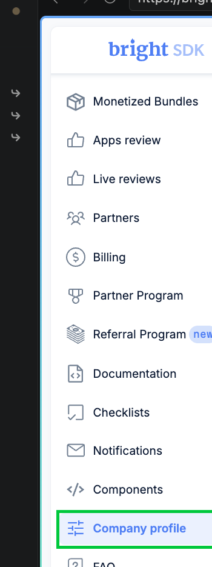
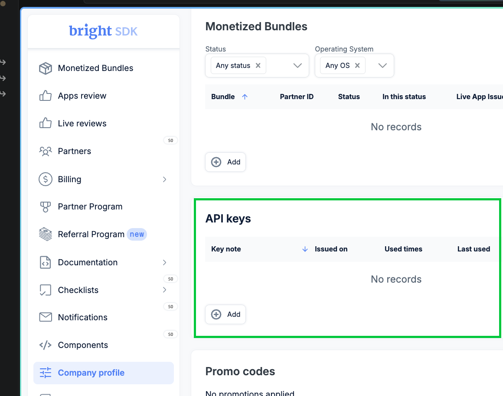
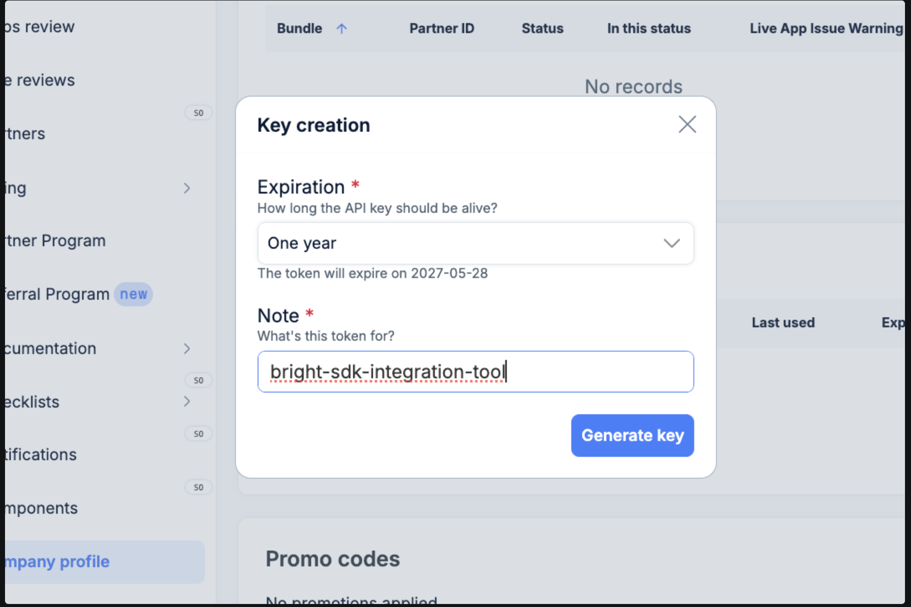
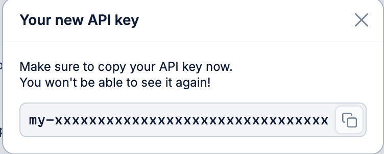

# Obtaining a BrightSDK API Key

The BrightSDK integration tool authenticates with the BrightSDK releases API using
an API key. Follow these steps to issue one from the BrightSDK Control Panel.

---

## Step 1 — Open Company Profile

Log in to the [BrightSDK Control Panel](https://bright-sdk.com/cp) and click
**Company profile** in the left sidebar.



---

## Step 2 — Find the API keys section

Scroll down the Company profile page until you see the **API keys** section.



---

## Step 3 — Create a new key

Click **+ Add** inside the API keys section. A dialog will appear:

- **Expiration** — choose how long the key should be valid (e.g. *One year*).
- **Note** — give the key a descriptive name so you remember what it is for,
  e.g. `bright-sdk-integration-tool`.

Click **Generate key**.



---

## Step 4 — Copy your key

The generated key is shown **once only** — copy it immediately.



> **Important:** Once you close this dialog the key value cannot be retrieved
> again. If you lose it, delete the key and create a new one.

---

## Step 5 — Set the key as an environment variable

Export the key in your shell so the tool can read it:

```bash
export SDK_API_KEY=<your-api-key>
```

To persist it across sessions, add the line to your shell profile
(`~/.bashrc`, `~/.zshrc`, or `~/.profile`):

```bash
echo 'export SDK_API_KEY=<your-api-key>' >> ~/.zshrc
```

The tool reads `SDK_API_KEY` automatically when calling the releases API.
No changes to `config.json` are needed.
