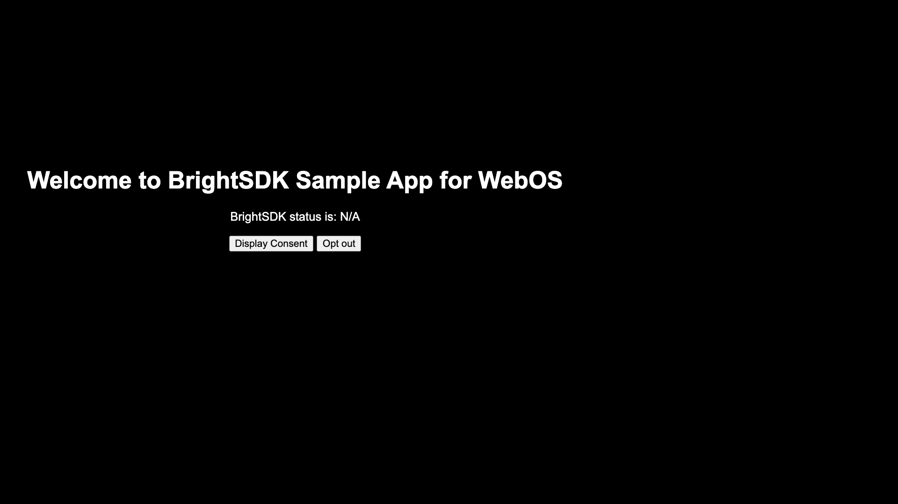

# BrightSDK — WebOS Integration Example

This folder demonstrates how to integrate BrightSDK into a WebOS TV app using the **bright-sdk-integration** CLI tool.

## Folder structure

```
webos/
├── app/                        ← WebOS web app source
│   ├── appinfo.json            ← LG app manifest
│   ├── index.html              ← main HTML with BrightSDK init
│   ├── icon.png
│   ├── largeIcon.png
│   └── webOSTVjs-1.2.10/       ← WebOS TV JS library
├── brd_sdk.config.json         ← SDK config (workdir, version, CDN URL)
├── auto-update.sh              ← non-interactive SDK update
├── interactive-update.sh       ← interactive update (prompts for missing values)
├── reset.sh                    ← remove downloaded SDK, restore clean state
├── assets/                     ← screenshots
└── README.md                   ← this file
```

## Prerequisites

- **Node.js ≥ 18** — to run the integration tool
- **WebOS SDK / CLI** — to package and deploy to a TV or emulator
- An internet connection — the SDK zip is downloaded from the CDN on first run

## Quick start

### 1. Install SDK files

```sh
cd webos
sh auto-update.sh
```

The tool will:
1. Download the latest BrightSDK zip from `cdn.bright-sdk.com/static/`
2. Extract `brd_api.js` and `brd_api.helper.js` into `app/`
3. Extract the `service/` directory for the background service
4. Inject SDK script tags into `app/index.html`
5. Save `brd_sdk.config.json` for future runs

### 2. Package and run

Use the WebOS CLI to package and install:

```sh
ares-package app service
ares-install com.brightsdk.sample.app_1.0.0_all.ipk
ares-launch com.brightsdk.sample.app
```

Or use the WebOS IDE to open and run the project.

### 3. What the app shows

- A status label reflecting the current SDK consent choice
- **Display Consent** — calls `BrightSDK.showConsent()`
- **Opt out** — calls `BrightSDK.optOut()`

### Screenshot

| Main screen |
|:-----------:|
|  |

## Using the tool with your own project

Copy `brd_sdk.config.json` next to your own app directory, then edit it:

```json
{
  "workdir": ".",
  "app_dir": "app",
  "libs_dir": "app",
  "index": "app/index.html",
  "sdk_service_dir": "service",
  "sdk_ver": "latest",
  "use_helper": true,
  "sdk_url": "https://cdn.bright-sdk.com/static/brd_sdk_webos-SDK_VER.zip"
}
```

| Key | Description |
|---|---|
| `workdir` | Working directory for the tool. |
| `app_dir` | Directory containing your web app files. |
| `libs_dir` | Directory where `brd_api.js` will be placed. |
| `index` | Path to `index.html` — SDK script tags are injected here. |
| `sdk_service_dir` | Directory for the background service. |
| `sdk_ver` | `"latest"` or a specific version string. |
| `use_helper` | Whether to include `brd_api.helper.js` (recommended). |
| `sdk_url` | CDN URL template — `SDK_VER` is replaced with the resolved version. |

Then run:

```sh
sh auto-update.sh     # non-interactive
sh interactive-update.sh  # interactive (prompts for missing values)
```
